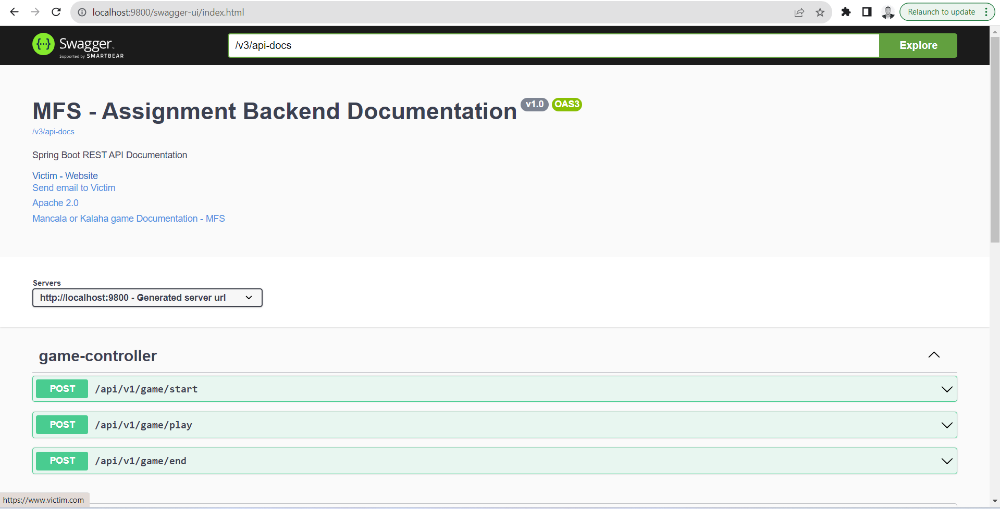
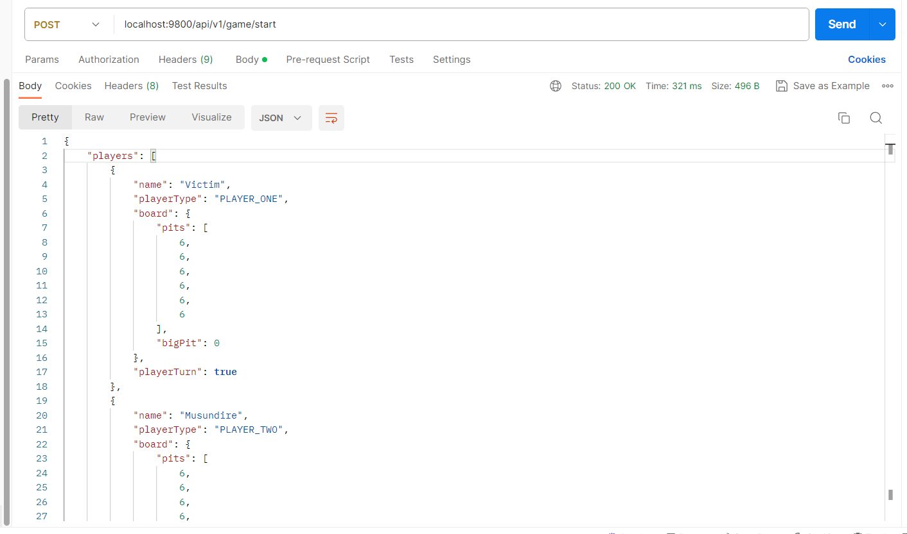

# MFS Africa - Assignment


## Start - Assumptions
* Java 17 is set up on the environment.
* Maven is set up on the environment.
* Docker is running on the system.
* Postman is installed - To use as client for tests.


## 1. How to run - Docker Compose.
* Run below command to create a jar that is being referenced when creating an image in the Dockerfile.
* NB* Run the following command in the root folder of the project.
   ```sh
    mvn clean package
   ```
* Run below command to build, (re)create, start and attach springboot-app to the  container.
* NB* Run the following command in the root folder of the project, where the docker-compose.yml file is located.
   ```sh
    docker-compose up
   ```
* Check http://localhost:9800/swagger-ui/index.html in the browser to see if its started.


## 2. How to run - Local env without Docker.
* If you do not have Docker,follow the following steps:
* NB* Run the following commands in the root folder of the project.
   ```sh
    mvn clean install
   ```
     ```sh
    mvn compile
   ```
* Then, run with the aid of your IDE.
* Check http://localhost:9800/swagger-ui/index.html in the browser to see if its started.


## 3. API, Swagger UI Documentation
* Below is the link to the API documentation, if the application has started properly.
* http://localhost:9800/swagger-ui/index.html


## 4. TODO: Recommendations
* Increase test coverage. 
* Add frontend as a separate module with either(VueJS, ReactJS, Angular)
* Add security to the backend code
* Add more validations

## 4. Some Screens




